# ⚡ GameOn (Sportify)

> **Play More. Play Together.** — A modern, local-first sports discovery, turf booking, and community matchmaking web application.

[](https://developer.mozilla.org/en-US/docs/Web/HTML)
[](https://developer.mozilla.org/en-US/docs/Web/CSS)
[](https://developer.mozilla.org/en-US/docs/Web/JavaScript)
[](https://developer.mozilla.org/en-US/docs/Web/API/IndexedDB_API)
[](./LICENSE)

---

## 📖 Table of Contents

- [Overview](#-overview)
- [Key Features](#-key-features)
- [🏟️ Featured Venues & Sports Gallery](#️-featured-venues--sports-gallery)
  - [⚽ Football](#-football)
  - [🏏 Box Cricket](#-box-cricket)
  - [🏸 Badminton](#-badminton)
  - [🎾 Lawn Tennis](#-lawn-tennis)
  - [🏀 Basketball](#-basketball)
  - [🏓 Pickleball](#-pickleball)
  - [🏐 Volleyball](#-volleyball)
- [System Architecture](#-system-architecture)
- [IndexedDB Database Schema](#-indexeddb-database-schema)
- [Project Directory Structure](#-project-directory-structure)
- [Getting Started](#-getting-started)
- [Seeding Sample Data](#-seeding-sample-data)
- [User Workflows](#-user-workflows)
  - [Player Experience](#1-player-experience)
  - [Venue Owner Experience](#2-venue-owner-experience)
- [Supported Sports Matrix](#-supported-sports-matrix)
- [License](#-license)

---

## 🌟 Overview

**GameOn (Sportify)** connects sports enthusiasts with local grounds, turfs, and courts while making community matchmaking effortless. Whether you want to book an entire football turf under the floodlights, join an open weekend box cricket match, or reserve a badminton court with friends, GameOn provides a seamless, responsive experience.

### Why GameOn?
- **Zero Server Setup**: Built with a **Local-First Architecture** running purely inside the browser using **IndexedDB (`SportifyDB`)** — no external backend, API keys, or cloud database servers required to run the complete platform.
- **Image Storage in IndexedDB**: Venue photographs are stored client-side as binary **Blobs**, allowing full persistence, offline capability, and instant rendering.
- **Community Matchmaking**: Players can create and join matches with automated cost-splitting and player capacity limits.
- **Dual-Role Management**: Dedicated portals and workflows for both **Players** and **Venue Owners**.

---

## 🚀 Key Features

| Feature | Description |
|---|---|
| 🔍 **Smart Venue Discovery** | Real-time multi-field search filtering by venue name, sport type, city, and address with instant feedback. |
| ⚡ **Game Matchmaking** | Browse public games, track remaining slots (`X / Y players`), and split turf booking costs among participants. |
| 📅 **Court & Turf Reservation** | Book specific courts with real-time operational hour verification, dynamic price summaries, and booking confirmation. |
| 👥 **Dual-Role Portals** | Seamless role selector (`role.html`) routing players to match lobbies and facility owners to venue onboarding. |
| 🏢 **Facility Owner Dashboard** | Register venues with court counts, hourly pricing, operational hours, amenities tags, and multi-photo uploads. |
| 📑 **My Bookings Tracker** | Personal dashboard tracking all organized matches, joined games, and booked courts. |
| 🗄️ **Local-First IndexedDB** | Robust client-side database (`SportifyDB` v3) supporting object stores for users, games, venue owners, and venues. |
| 🧪 **One-Click Seeder Utility** | Built-in data seeder (`seed.html`) that populates the database with 10 real sports venues, real photos, and scheduled games. |

---

## 🏟️ Featured Venues & Sports Gallery

GameOn comes pre-configured with top-tier sports facilities across major metropolitan hubs. All venue photos are stored locally and loaded seamlessly:

### ⚽ Football

| **Apex Football Arena** | **Velocity Football Park** |
|:---:|:---:|
| 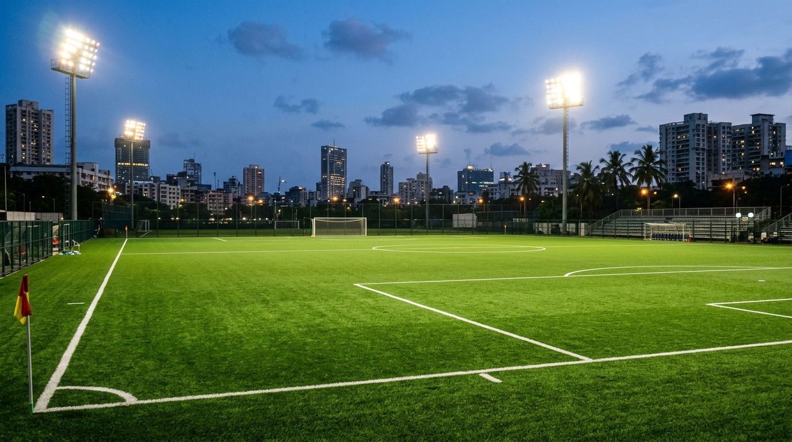 | 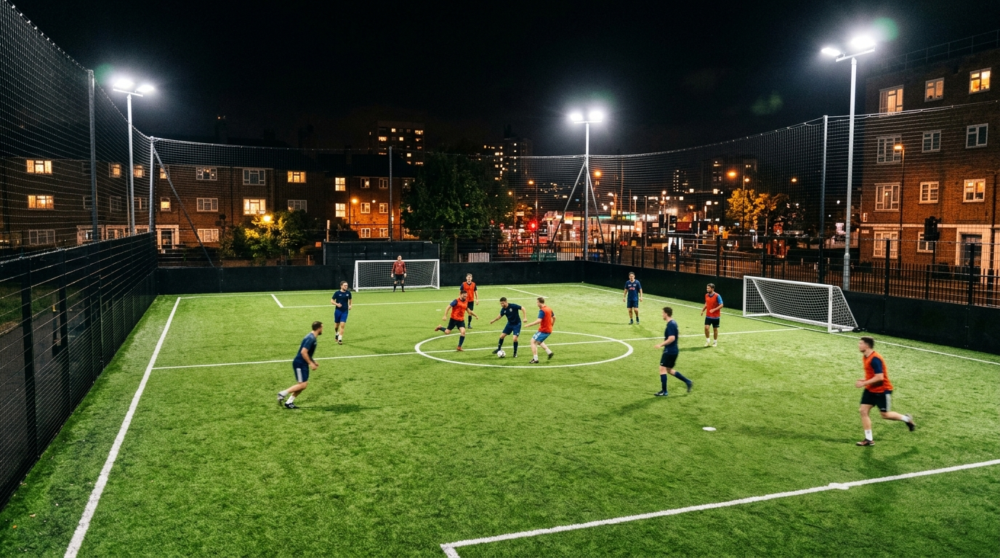 |
| 📍 **Mumbai** — BKC Complex, Bandra East | 📍 **Delhi** — Chhatarpur Enclave |
| **Pitch Type:** 7-a-side FIFA-grade artificial turf<br>**Courts:** 2 Pitches \| **Rate:** ₹1,400 / hr<br>**Timings:** 06:00 - 23:30<br>**Amenities:** Floodlights, Locker Room, Parking, Cafeteria | **Pitch Type:** 5-a-side floodlit astro turf<br>**Courts:** 3 Pitches \| **Rate:** ₹1,200 / hr<br>**Timings:** 06:00 - 23:00<br>**Amenities:** Late Night Turf, Bibs & Balls, Bleachers, Parking |

---

### 🏏 Box Cricket

| **Master Blaster Box Turf** | **Skyline Cricket Box** |
|:---:|:---:|
| 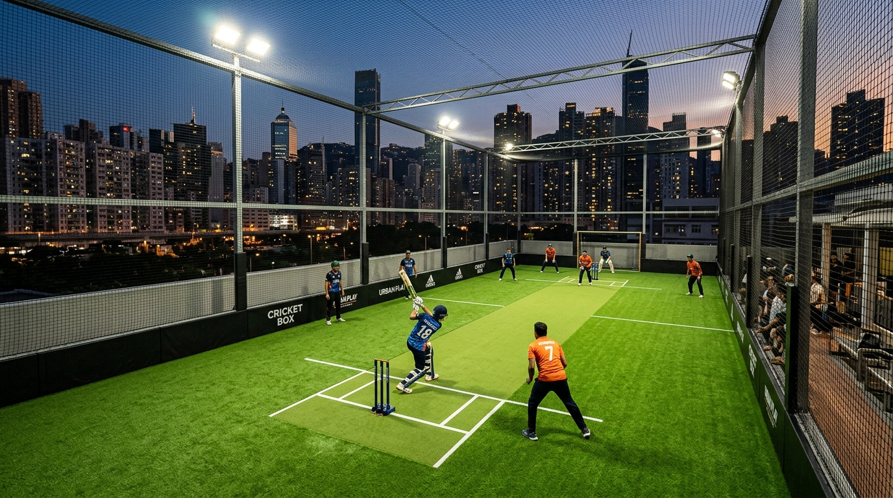 | 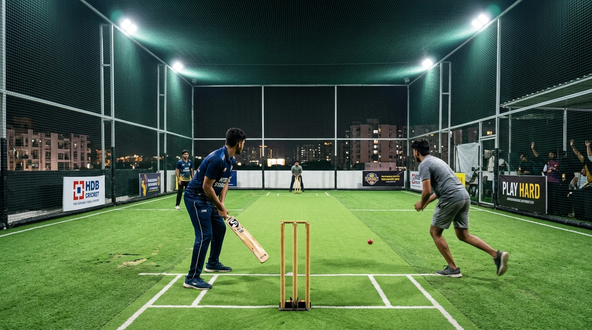 |
| 📍 **Delhi** — Sector 21, Dwarka | 📍 **Hyderabad** — HITEC City, Madhapur |
| **Pitch Type:** All-weather astro turf box arena<br>**Courts:** 3 Nets \| **Rate:** ₹1,600 / hr<br>**Timings:** 06:00 - 23:59<br>**Amenities:** High boundary nets, Bowling machine, Floodlights | **Pitch Type:** Enclosed 8v8 box cricket turf<br>**Courts:** 2 Nets \| **Rate:** ₹1,300 / hr<br>**Timings:** 06:00 - 23:00<br>**Amenities:** High Ceiling Nets, Match Umpires, Live Stream, Snack Bar |

---

### 🏸 Badminton

| **SmashPoint Badminton Hub** | **ShuttleStream Badminton Club** |
|:---:|:---:|
| 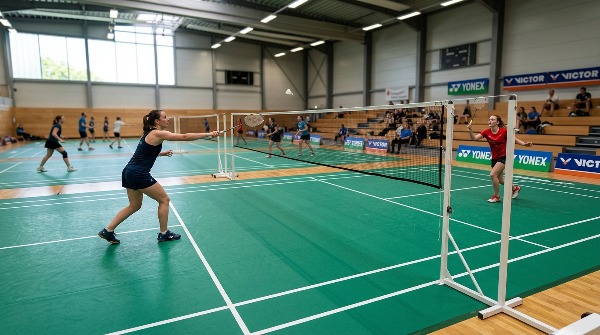 | 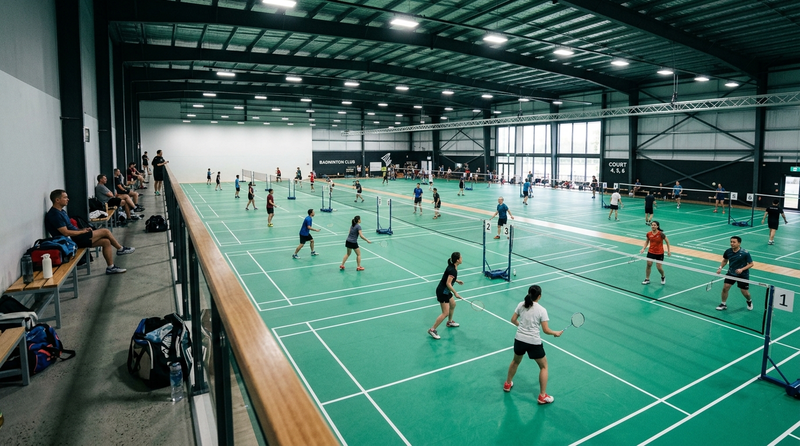 |
| 📍 **Bengaluru** — 80 Feet Road, Indiranagar | 📍 **Pune** — Baner - Pashan Link Road |
| **Court Type:** BWF-standard synthetic & wooden courts<br>**Courts:** 6 Courts \| **Rate:** ₹500 / hr<br>**Timings:** 05:30 - 22:30<br>**Amenities:** Yonex Synthetic Mats, AC Lounge, Showers, Lockers | **Court Type:** Cushioned shock-resistant PVC courts<br>**Courts:** 5 Courts \| **Rate:** ₹450 / hr<br>**Timings:** 05:30 - 22:00<br>**Amenities:** Racket Stringing, Pro Coaching, Tournament Lighting |

---

### 🎾 Lawn Tennis

| **Ace Grand Tennis Academy** |
|:---:|
| 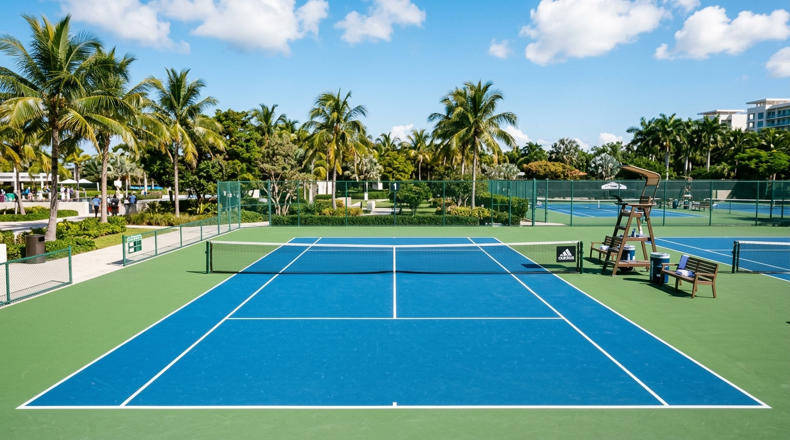 |
| 📍 **Pune** — Kalyani Nagar, Near Jogger's Park |
| **Court Type:** Championship-grade acrylic hard courts & clay courts<br>**Courts:** 4 Courts \| **Rate:** ₹800 / hr \| **Timings:** 06:00 - 21:00<br>**Amenities:** Hard Courts, Clay Courts, Pro Shop, Changing Rooms, Certified Coaches |

---

### 🏀 Basketball

| **DunkNation Basketball Court** |
|:---:|
| 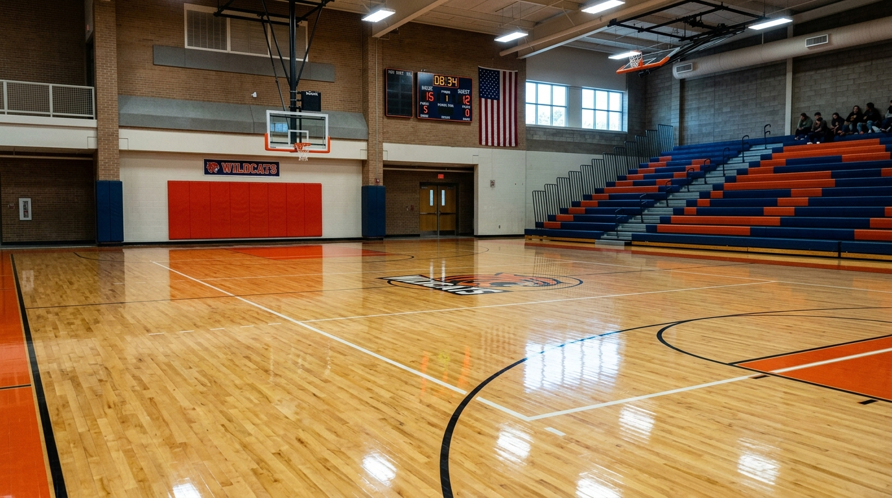 |
| 📍 **Hyderabad** — Financial District, Gachibowli |
| **Court Type:** FIBA regulation indoor hardwood & outdoor acrylic courts<br>**Courts:** 2 Courts \| **Rate:** ₹750 / hr \| **Timings:** 06:00 - 22:00<br>**Amenities:** FIBA Regulation Hoops, Anti-Skid Surface, Electronic Scoreboard, Night Lights |

---

### 🏓 Pickleball

| **PickleParadise Arena** |
|:---:|
| 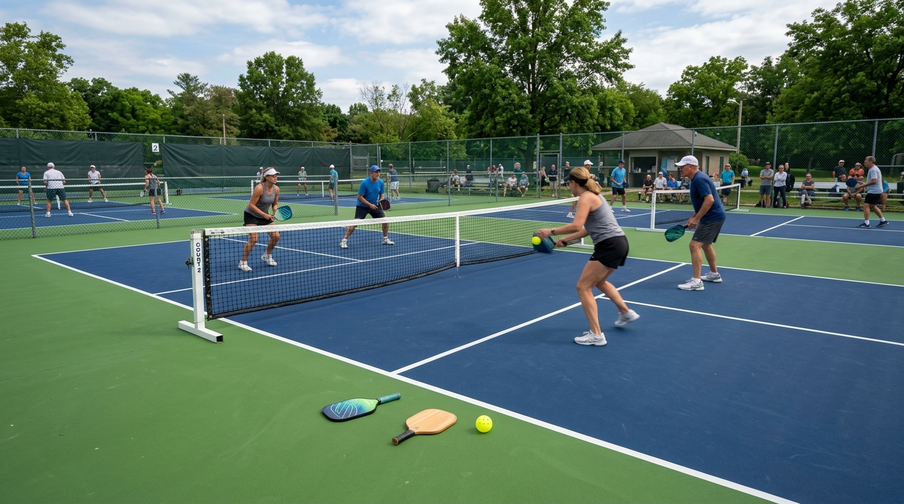 |
| 📍 **Mumbai** — Link Road, Andheri West |
| **Court Type:** Dedicated non-glare outdoor tournament pickleball courts<br>**Courts:** 4 Courts \| **Rate:** ₹600 / hr \| **Timings:** 07:00 - 22:00<br>**Amenities:** Paddles & Balls Provided, Ball Machines, Chilled Water Lounge, Bleachers |

---

### 🏐 Volleyball

| **SpikeZone Volleyball Club** |
|:---:|
| 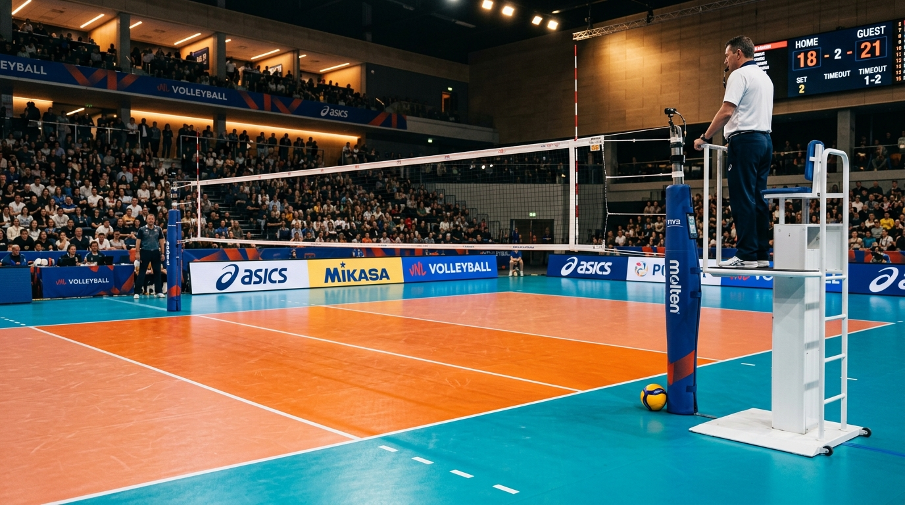 |
| 📍 **Bengaluru** — Sarjapur Main Road |
| **Court Type:** Professional rubberized indoor arena & outdoor sand court<br>**Courts:** 2 Courts \| **Rate:** ₹700 / hr \| **Timings:** 06:00 - 21:30<br>**Amenities:** Sand & Hard Courts, Shower Facility, First Aid, High-mast Floodlights |

---

## 🏗️ System Architecture

GameOn is designed as an ultra-fast, local-first client-side web application. It uses standard browser capabilities to provide high performance without complex infrastructure:

```mermaid
graph TD
    User([User / Browser])

    subgraph Presentation_Layer [Presentation Layer (HTML5 & CSS3)]
        Home[index.html - Landing Page]
        Venues[venue.html - Venue Catalog]
        Games[games.html - Matchmaking Lobby]
        Booking[booking.html - Court Reservation]
        MyBookings[myBookings.html - Booking History]
        Role[role.html - Role Selection]
        AuthUI[login.html / signup.html]
        OwnerUI[venue-register.html / venue-login.html]
        Seeder[seed.html - One-Click Database Seeder]
    end

    subgraph Logic_Layer [Logic Layer (Vanilla ES6+)]
        AppJS[Backend/app.js - Session & Navbar]
        VenueJS[Backend/venue.js - Venue Filtering & Search]
        GameJS[Backend/game.js - Matchmaking & Cost Splitting]
        BookingJS[Backend/booking.js - Court Booking Engine]
        AuthJS[Backend/auth.js & login.js - User Auth]
        OwnerJS[Backend/venue-register.js - Facility Onboarding]
        SeedJS[seed-photos.js - Base64 Photo Blobs]
    end

    subgraph Storage_Layer [Storage Layer (Browser Native)]
        LS[(localStorage - Current User Session)]
        IDB[(IndexedDB: SportifyDB v3)]
        UsersStore[(ObjectStore: users)]
        VenuesStore[(ObjectStore: venues)]
        GamesStore[(ObjectStore: games)]
        OwnersStore[(ObjectStore: venueOwners)]
    end

    User --> Home
    User --> Venues
    User --> Games
    User --> Booking
    User --> Role
    User --> Seeder

    Venues --> VenueJS
    Games --> GameJS
    Booking --> BookingJS
    AuthUI --> AuthJS
    OwnerUI --> OwnerJS
    Seeder --> SeedJS

    AppJS <--> LS
    AuthJS <--> UsersStore
    OwnerJS <--> VenuesStore
    OwnerJS <--> OwnersStore
    VenueJS <--> VenuesStore
    GameJS <--> GamesStore
    GameJS <--> VenuesStore
    BookingJS <--> VenuesStore
    BookingJS <--> GamesStore
    SeedJS --> VenuesStore
    SeedJS --> GamesStore
```

---

## 🗄️ IndexedDB Database Schema

The application uses **IndexedDB** database named **`SportifyDB`** (Version `3`). It maintains 4 core object stores:

### 1. `venues`
Stores sports facilities registered by venue owners or seeded:
- **`id`** *(Number, Auto-Increment Primary Key)*
- **`ownerId`** *(Number, Index)*: ID of the registered facility owner.
- **`venueName`** *(String)*: Title of the sports facility.
- **`sport`** *(String, Index)*: Sport type (`football`, `cricket`, `badminton`, `tennis`, `basketball`, `pickleball`, `volleyball`).
- **`city`** *(String, Index)*: City location (`Mumbai`, `Bengaluru`, `Delhi`, `Pune`, `Hyderabad`, etc.).
- **`address`** *(String)*: Street address.
- **`courts`** *(Number)*: Total number of courts or pitches available.
- **`openingTime`** *(String)*: Opening hour (e.g. `"06:00"`).
- **`closingTime`** *(String)*: Closing hour (e.g. `"23:30"`).
- **`price`** *(Number)*: Hourly rate in ₹.
- **`amenities`** *(Array of Strings)*: Facility perks (e.g. `["Floodlights", "Parking", "Locker Room"]`).
- **`photos`** *(Array of Blobs)*: Real photographic image blobs stored directly in IndexedDB.
- **`description`** *(String)*: Detailed venue overview.

### 2. `games`
Stores active matches created by players or seeded:
- **`id`** *(Number, Auto-Increment Primary Key)*
- **`venueId`** *(Number)*: Associated venue ID.
- **`venueName`** *(String)*: Name of the venue.
- **`sport`** *(String, Index)*: Sport category.
- **`location`** *(String, Index)*: City and neighborhood.
- **`date`** *(String, Index)*: Match date (`YYYY-MM-DD`).
- **`startTime`** / **`endTime`** *(String)*: Slot timings.
- **`creatorId`** *(Number, Index)*: ID of the user organizing the match.
- **`players`** *(Array of Numbers)*: User IDs who joined the game.
- **`maxPlayers`** *(Number)*: Maximum allowed participants.
- **`price`** *(Number)*: Total venue fee (split automatically among players).
- **`status`** *(String)*: Game status (`"open"`, `"filling"`, `"closed"`).

### 3. `users`
Stores player authentication profiles:
- **`id`** *(Number, Auto-Increment Primary Key)*
- **`fullName`** *(String)*: Player name.
- **`email`** / **`emailId`** *(String, Unique Index)*: Email credentials.
- **`phone`** *(String)*: Contact phone number.
- **`password`** *(String)*: Password string.
- **`city`** *(String)*: Home city.
- **`createdAt`** *(Number)*: Epoch timestamp.

### 4. `venueOwners`
Stores commercial venue administrator credentials:
- **`id`** *(Number, Auto-Increment Primary Key)*
- **`ownerName`** *(String)*: Contact person name.
- **`businessEmail`** *(String, Unique Index)*: Registered business email.
- **`phone`** *(String)*: Contact number.
- **`password`** *(String)*: Account password.

---

## 📁 Project Directory Structure

```text
GameOn/
├── index.html                  # Main Landing Page (Hero, quick stats, featured sports)
├── seed.html                   # Built-in Administrative Seeder Tool
├── seed-photos.js              # High-definition Base64 image assets for seeding
├── README.md                   # Project documentation & visual guide
├── LICENSE                     # MIT Open Source License
│
├── images/                     # Local high-resolution venue photography
│   ├── ace_tennis_academy.jpg
│   ├── apex_football_arena.jpg
│   ├── dunknation_basketball.jpg
│   ├── master_blaster_cricket.jpg
│   ├── pickle_paradise.jpg
│   ├── shuttlestream_badminton.jpg
│   ├── skyline_cricket_box.jpg
│   ├── smashpoint_badminton.jpg
│   ├── spikezone_volleyball.jpg
│   └── velocity_football_park.jpg
│
├── Frontend/                   # User-facing application views
│   ├── role.html               # Role Selector (Player vs. Venue Owner)
│   ├── venue.html              # Venue Explorer & Multi-filter search
│   ├── games.html              # Game Matchmaking Lobby & Community Games
│   ├── booking.html            # Court Reservation & Slot Calculator
│   ├── myBookings.html         # User Dashboard (My Games & Court Reservations)
│   ├── profile.html            # User Profile & Activity overview
│   ├── login.html              # Player Login screen
│   ├── signup.html             # Player Registration screen
│   ├── venue-login.html        # Venue Owner Login screen
│   └── venue-register.html     # Venue Owner & Facility Onboarding Form
│
├── Backend/                    # Client-side business logic & database controllers
│   ├── db.js                   # IndexedDB schema initialiser (SportifyDB v3)
│   ├── app.js                  # Global session detector & Navbar state manager
│   ├── auth.js                 # Player signup controller
│   ├── login.js                # Player login controller & session starter
│   ├── venue.js                # Venue fetching, filtering, and card renderer
│   ├── game.js                 # Games matchmaking controller & slot counter
│   ├── booking.js              # Slot pricing calculations & reservation writer
│   ├── myBookings.js           # Bookings aggregator for current user
│   ├── profile.js              # User profile loader & display
│   └── venue-register.js       # Facility registration & photo upload handler
│
└── CSS/                        # Modular stylesheet system
    ├── style.css               # Landing page aesthetics, typography & hero styles
    ├── navbar.css              # Global navigation bar & header styles
    ├── venue.css               # Venue catalog & card layout styling
    ├── games.css               # Games matchmaking grid & slot chips
    ├── booking.css             # Court detail & booking form layout
    ├── role.css                # Role selection split card styling
    ├── login.css               # Player authentication styling
    ├── signup.css              # Player signup styling
    ├── profile.css             # Profile screen styling
    ├── venue-login.css         # Venue owner login styling
    └── venue-register.css      # Venue registration multi-step form styling
```

---

## ⚡ Getting Started

GameOn runs completely client-side in any modern web browser (Google Chrome, Microsoft Edge, Mozilla Firefox, Safari).

### Method 1: Direct Browser Launch
1. Clone or download the repository to your local computer:
   ```bash
   git clone https://github.com/SansarKakkar/GameOn.git
   ```
2. Navigate into the project folder.
3. Double-click **`index.html`** to open it directly in your favorite browser.

### Method 2: Local Static Server (Recommended)
Running through a local static HTTP server ensures smooth IndexedDB and Blob URL handling:

- **Using Node.js (`npx serve`)**:
  ```bash
  npx serve .
  ```
- **Using Python**:
  ```bash
  python -m http.server 8000
  ```
- **Using VS Code Live Server**:
  Right-click `index.html` and choose **"Open with Live Server"**.

Visit `http://localhost:8000` (or the port indicated in your terminal).

---

## 🌱 Seeding Sample Data

To explore the application with realistic venues, photographs, and active games immediately:

1. Open **`seed.html`** in your browser (`http://localhost:8000/seed.html` or double-click `seed.html`).
2. Click the green **`Seed Venues & Games`** button.
3. The seeder will:
   - Initialize `SportifyDB` (Version 3).
   - Create the default test player account:
     - **Email:** `sansar@example.com`
     - **Password:** `Password123`
   - Convert high-resolution photos into binary Blobs and store them in the `venues` store.
   - Insert 10 diverse sports venues (Football, Cricket, Badminton, Tennis, Basketball, Pickleball, Volleyball).
   - Populate active, joinable games across various dates and sports.
4. Click **`Go to Explore Venues`** or **`Go to Find Games`** to begin!

---

## 🔄 User Workflows

### 1. Player Experience
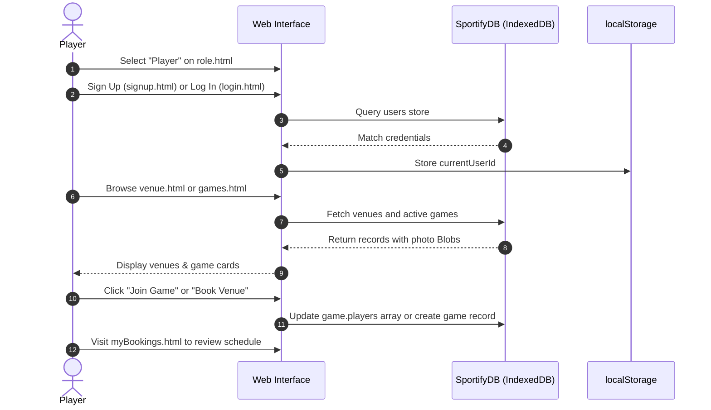

### 2. Venue Owner Experience
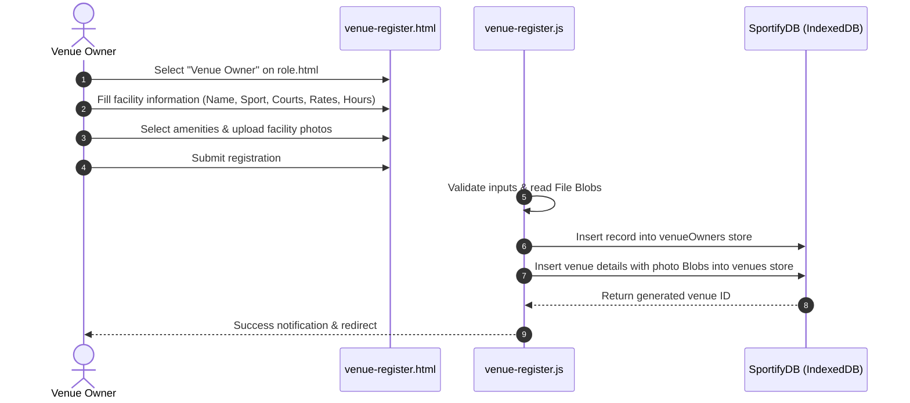

---

## 📊 Supported Sports Matrix

GameOn provides pre-configured logic, capacity limits, and court categories tailored for each sport:

| Sport | Icon | Default Max Players | Common Court Types | Typical Hourly Range |
|---|:---:|:---:|---|:---:|
| **Football** | ⚽ | 12 | 5-a-side / 7-a-side Artificial Turf | ₹1,200 – ₹1,500 |
| **Box Cricket** | 🏏 | 12 | Enclosed Astro Turf Box Nets | ₹1,300 – ₹1,600 |
| **Badminton** | 🏸 | 4 | BWF Synthetic Mats / Teak Wood | ₹450 – ₹600 |
| **Lawn Tennis** | 🎾 | 4 | Acrylic Hard Courts / Red Clay | ₹700 – ₹900 |
| **Basketball** | 🏀 | 12 | Indoor Hardwood / Outdoor Acrylic | ₹700 – ₹850 |
| **Pickleball** | 🏓 | 4 | Non-Glare Textured Outdoor Courts | ₹550 – ₹700 |
| **Volleyball** | 🏐 | 12 | Shock-Absorption Rubber / Sand Court | ₹650 – ₹800 |

---

## 🛠️ Built With

- **HTML5**: Semantic tags, accessible forms, and structured layouts.
- **CSS3**: Custom design tokens, glassmorphism cards, responsive flexbox & CSS grid.
- **JavaScript (ES6+)**: Async/Await, URLSearchParams, DOM manipulation, Blob API, Object URLs.
- **IndexedDB**: Persistent client-side database (`SportifyDB`) supporting object stores and search indexes.
- **Local-First Architecture**: 100% offline-capable, serverless client execution.

---

## 📄 License

This project is licensed under the **MIT License**. See the [LICENSE](./LICENSE) file for details.

---

<p align="center">
  <b>Built with ❤️ for sports communities everywhere.</b><br>
  <i>Ready to play? Find your next game on <b>GameOn</b>!</i>
</p>