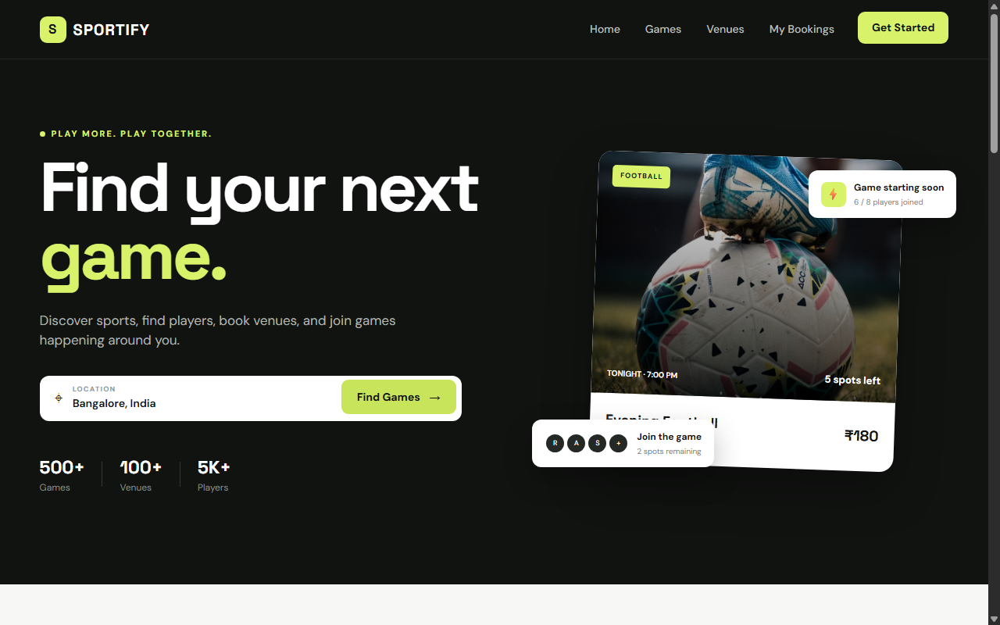
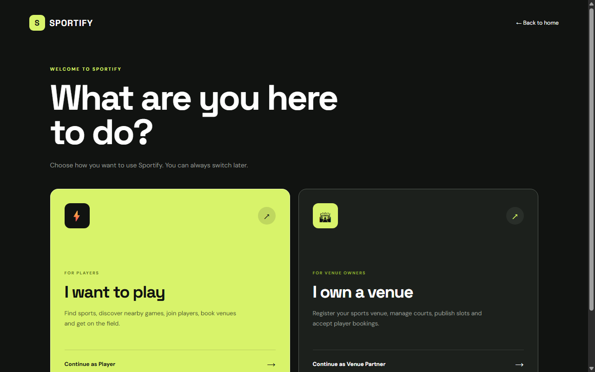
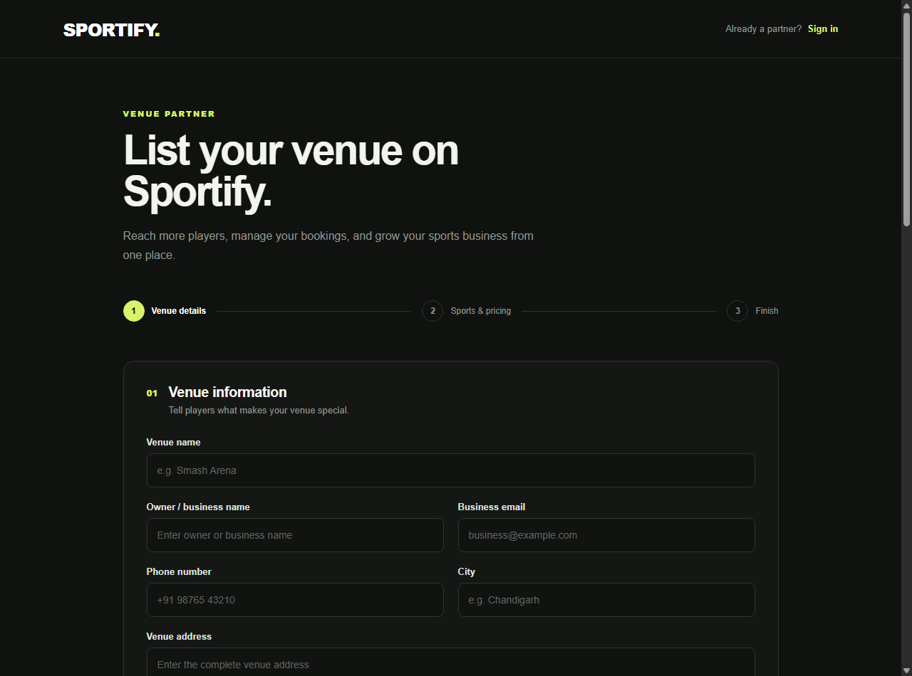
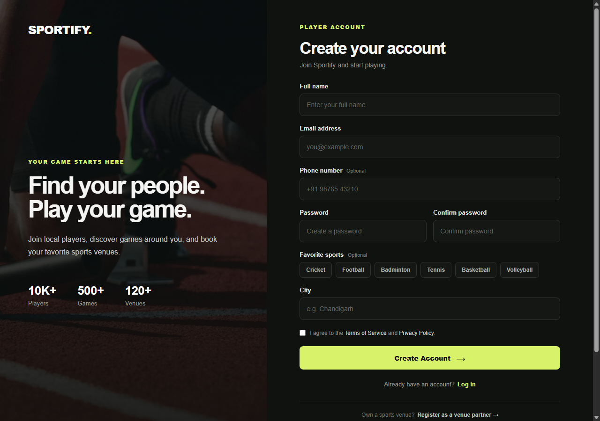
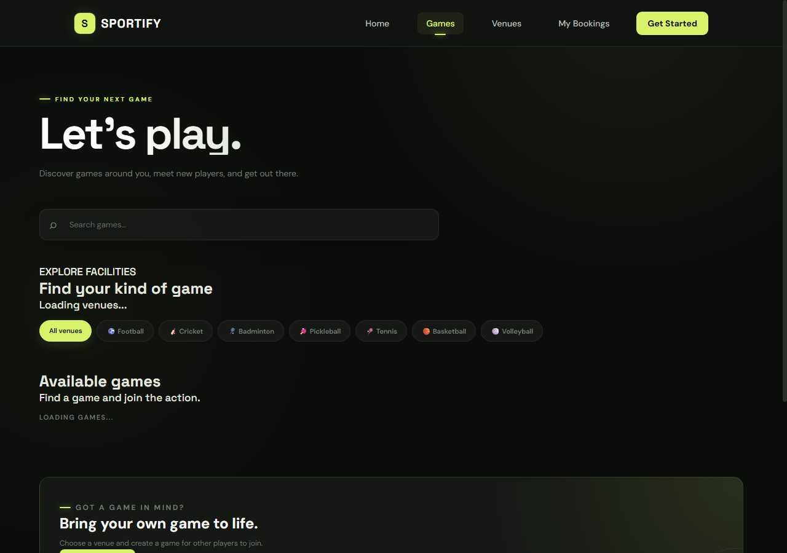
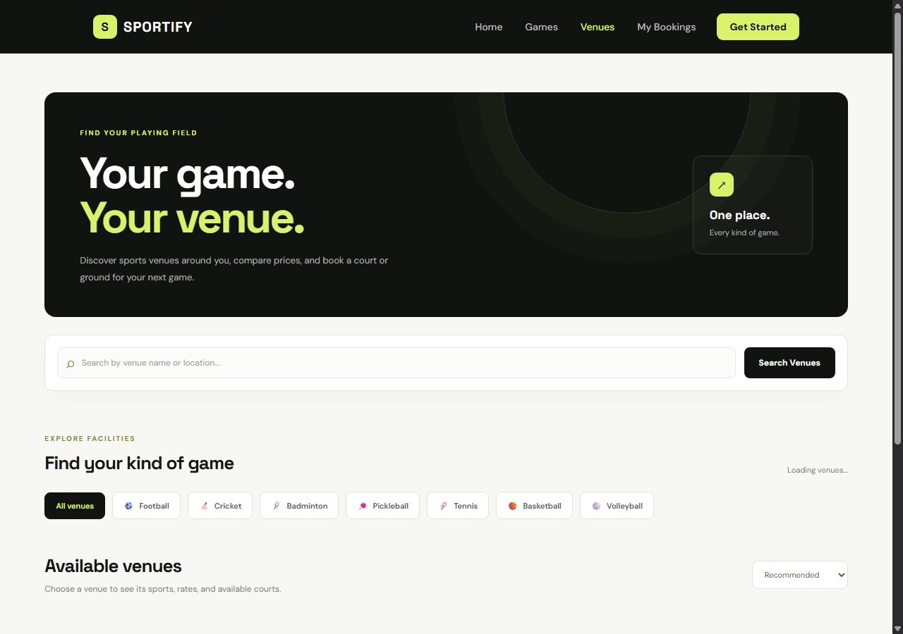
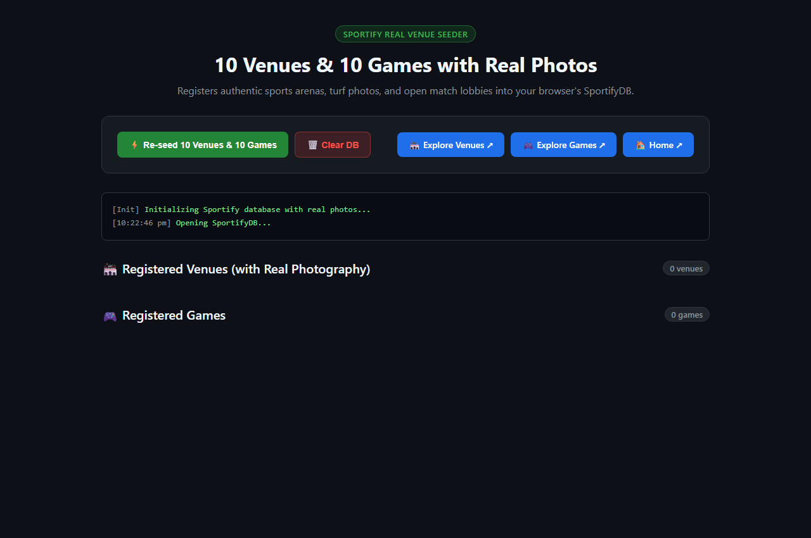
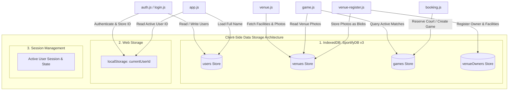

# ⚡ GameOn (Sportify)

> **Play More. Play Together.** — A modern, responsive, local-first sports venue discovery, turf booking, and community matchmaking web application built entirely with vanilla web technologies.

[](https://developer.mozilla.org/en-US/docs/Web/HTML)
[](https://developer.mozilla.org/en-US/docs/Web/CSS)
[](https://developer.mozilla.org/en-US/docs/Web/JavaScript)
[](https://developer.mozilla.org/en-US/docs/Web/API/IndexedDB_API)
[](https://developer.mozilla.org/en-US/docs/Web/API/Web_Storage_API)
[](./LICENSE)

---

## 📑 Table of Contents

- [Project Overview](#-project-overview)
- [Application Screenshots (UI Showcase)](#-application-screenshots-ui-showcase)
- [Prerequisites](#-prerequisites)
- [Step-by-Step Setup & How to Run](#-step-by-step-setup--how-to-run)
- [Technical Stack & Class Curriculum Compliance](#-technical-stack--class-curriculum-compliance)
- [Multi-Page Architecture](#-multi-page-architecture)
- [Data Storage Implementation](#-data-storage-implementation)
  - [1. IndexedDB (`SportifyDB` v3)](#1-indexeddb-sportifydb-v3)
  - [2. Web Storage (`localStorage`)](#2-web-storage-localstorage)
  - [3. Session & Cookies](#3-session--cookies)
- [Full CRUD Operations Mapping](#-full-crud-operations-mapping)
- [Generic Sports Venue Model](#-generic-sports-venue-model)
- [Responsive Design (Mobile, Tablet, Desktop)](#-responsive-design-mobile-tablet-desktop)
- [Project Directory Structure](#-project-directory-structure)
- [Seeding Demo Data](#-seeding-demo-data)
- [GitHub & Academic Guidelines Compliance](#-github--academic-guidelines-compliance)
- [License](#-license)

---

## 🌟 Project Overview

**GameOn (Sportify)** is a sports community and turf reservation web platform designed to solve two core challenges:
1. **For Players**: Finding nearby sports grounds (football turfs, cricket nets, badminton courts, tennis academies, basketball arenas), discovering open pickup games, and splitting venue booking fees transparently among teammates.
2. **For Venue Owners**: Listing sports facilities, configuring available courts/pitches, setting operating schedules and hourly rates, specifying amenities, and managing customer bookings without expensive cloud infrastructure.

### Key Highlights
- **100% Vanilla Web Stack**: Built purely using standard **HTML5**, **CSS3**, and **JavaScript (ES6+)**. No external frontend JavaScript libraries or frameworks (no React, Vue, jQuery, or Bootstrap JS).
- **Local-First Zero-Backend Architecture**: Operates directly inside the browser using **IndexedDB (`SportifyDB`)** and **Web Storage (`localStorage`)**. Full CRUD functionality runs offline without requiring cloud database subscriptions or server APIs.
- **Client-Side Binary Media**: Facility photos are stored directly in IndexedDB as binary **Blobs** and dynamically rendered via `URL.createObjectURL`.

---

## 📸 Application Screenshots (UI Showcase)

Actual captures from the live application illustrating its modern dark-mode aesthetic, typography, and responsive interface:

### 1. Landing Page & Hero Section
| **Desktop View (1280px)** |
|:---:|
|  |
| *Hero banner with neon accents, real-time search, platform statistics (500+ Games, 100+ Venues, 5K+ Players), and active match highlights.* |

---

### 2. Dual-Role Experience & Authentication
| **Role Selector (`role.html`)** | **Venue Partner Registration (`venue-register.html`)** |
|:---:|:---:|
|  |  |
| *Intuitive entry gateway guiding users to either the Player Lobby or the Venue Partner Onboarding workflow.* | *Multi-step onboarding form with sport picker, pricing, hours, amenities checklist, and photo upload.* |

---

### 3. Player Registration & Matchmaking
| **Player Sign Up (`signup.html`)** | **Community Games Lobby (`games.html`)** |
|:---:|:---:|
|  |  |
| *HTML5 client-side form with full validation for name, email, phone, city, and password verification.* | *Filter games by sport category (Football, Cricket, Badminton, Tennis, etc.) with real-time slot counters.* |

---

### 4. Venue Catalog & One-Click Seeder
| **Venue Exploration (`venue.html`)** | **Database Seeder Utility (`seed.html`)** |
|:---:|:---:|
|  |  |
| *Multi-filter facility explorer with real-time text search and sport tag filtering.* | *Administrative utility to pre-populate realistic venues, matches, and photo blobs with one click.* |

---

## 💻 Prerequisites

To run this application, you only need:
1. **Any modern web browser**:
   - Google Chrome (v90+)
   - Microsoft Edge (v90+)
   - Mozilla Firefox (v88+)
   - Apple Safari (v14+)
2. **Git** (optional, to clone the repository).
3. **Python 3** or **Node.js** (optional, recommended for launching a local HTTP server).

---

## 🚀 Step-by-Step Setup & How to Run

### Step 1: Clone or Download the Repository
Open your terminal / command prompt and run:
```bash
git clone https://github.com/SansarKakkar/GameOn.git
cd GameOn
```

---

### Step 2: Launch the Application

#### Option A: Using a Local HTTP Server (Recommended)
Running through an HTTP server ensures optimal IndexedDB origins and smooth binary `Blob` object URL handling:

- **Using Python 3**:
  ```bash
  python -m http.server 8000
  ```
  Then navigate to: `http://localhost:8000`

- **Using Node.js (`npx serve`)**:
  ```bash
  npx serve .
  ```
  Then open the local URL shown in your terminal.

- **Using VS Code Live Server**:
  Right-click `index.html` inside VS Code and select **"Open with Live Server"**.

#### Option B: Direct Browser Launch (Zero Installation)
Simply double-click the **`index.html`** file in your file explorer to open it directly in your browser.

---

### Step 3: Populate Sample Data with the Seeder
To test the application with real sports venues, realistic photos, and active games immediately:
1. Open **`seed.html`** in your browser (`http://localhost:8000/seed.html` or double-click `seed.html`).
2. Click the green **`Seed Venues & Games`** button.
3. The built-in seeder will populate `SportifyDB` with authentic facilities, match lobbies, and a default player account:
   - **Default Email:** `sansar@example.com`
   - **Default Password:** `Password123`
4. Click **"Explore Venues"** or **"Explore Games"** to experience the app!

---

## 🛠️ Technical Stack & Class Curriculum Compliance

This project is built strictly following standard academic curriculum guidelines without external frontend frameworks:

| Area | Technologies Used | Implementation Details |
|---|---|---|
| **Structure** | **HTML5** | Semantic tags (`<header>`, `<nav>`, `<main>`, `<section>`, `<article>`, `<footer>`), structured forms, client-side input validations (`required`, `type="email"`, `type="search"`, `type="number"`, `min`, `max`). |
| **Styling** | **Vanilla CSS3** | Custom CSS design tokens (`:root` variables), CSS Flexbox, CSS Grid layouts, media queries for mobile/tablet/desktop responsiveness, micro-animations, pseudo-elements, glassmorphism card styling. *Zero CSS utility frameworks (no Tailwind).* |
| **Logic** | **Vanilla JavaScript (ES6+)** | DOM manipulation (`createElement`, `replaceChildren`, `appendChild`), Event delegation & listeners, Async/Await with Promises, URL parameter parsing (`URLSearchParams`), Blob API for binary photo rendering, Array operations (`filter`, `map`, `reduce`, `some`, `find`). *Zero external JS libraries.* |
| **Persistence** | **IndexedDB + Web Storage** | Browser-native `IndexedDB` (`SportifyDB` v3) for complex multi-store persistence and `localStorage` for session token management. |

---

## 📄 Multi-Page Architecture

The application contains **10+ distinct, interconnected pages** (exceeding the 2-page requirement):

```text
├── index.html                  # Landing Page with Hero, Search Bar, and Featured Highlights
├── seed.html                   # Administrative Database Seeder & Data Management Suite
└── Frontend/
    ├── role.html               # Dual-Role Selector (Player vs. Venue Owner)
    ├── venue.html              # Venue Catalog with Live Search & Sport Filter Tabs
    ├── games.html              # Community Games Matchmaking Lobby & Player Slots
    ├── booking.html            # Court Reservation, Date/Time Picker & Pricing Engine
    ├── myBookings.html         # User Dashboard (My Registered Games & Reserved Courts)
    ├── profile.html            # User Profile, City, and Activity Overview
    ├── login.html              # Player Authentication Screen
    ├── signup.html             # Player Registration with Form Validation
    ├── venue-register.html     # Comprehensive Venue Partner Onboarding Form
    └── venue-login.html        # Facility Owner Login Portal
```

---

## 💾 Data Storage Implementation

The project implements comprehensive client-side data storage using three distinct browser storage layers:



### 1. IndexedDB (`SportifyDB` v3)
The core relational client-side database maintaining 4 object stores:
- **`venues`**: Stores sports facilities with auto-increment ID, owner ID, sport category, city, courts count, hourly rate, amenities array, and photos stored as binary `Blob` objects.
- **`games`**: Stores scheduled matches with date, venue ID, sport, creator ID, registered players array (`players: [1, 2]`), maximum player limits, and pricing.
- **`users`**: Stores registered player accounts with unique email index, phone, hashed password, and home city.
- **`venueOwners`**: Stores commercial venue administrators with unique business email index and credentials.

### 2. Web Storage (`localStorage`)
- Stores `currentUserId` upon successful authentication.
- Read globally across all pages by `Backend/app.js` to update header navigation (toggling between "Get Started" and "Welcome [Name]").

### 3. Session & Cookies
- Session state lifecycle management persists the logged-in player across page transitions.
- Graceful session clearance upon logout.

---

## 🔄 Full CRUD Operations Mapping

The application implements complete **Create, Read, Update, and Delete** operations across its entities:

| Operation | Entity | File / Function | Description |
|:---:|---|---|---|
| **CREATE** | **User Account** | `Backend/auth.js` (`signUp`) | Adds new player record to `users` store with email uniqueness check. |
| **CREATE** | **Venue Facility** | `Backend/venue-register.js` (`register`) | Adds new facility with court count, pricing, and image Blobs to `venues` store. |
| **CREATE** | **Game / Booking** | `Backend/booking.js` | Creates new match session or court reservation in `games` store. |
| **READ** | **Venue Explorer** | `Backend/venue.js` (`loadvenue`) | Reads all venues using `store.getAll()`, dynamic text search and sport filtering. |
| **READ** | **Games Lobby** | `Backend/game.js` | Reads all active matches, checks dates, and displays remaining player slots. |
| **READ** | **User Profile** | `Backend/profile.js` & `app.js` | Reads current user details from `users` store using `userStore.get(userId)`. |
| **READ** | **My Bookings** | `Backend/myBookings.js` | Queries `games` store and filters matches where `game.players.includes(userId)`. |
| **UPDATE** | **Join Game** | `Backend/game.js` | Appends player ID to `game.players` array in IndexedDB and updates slot counter. |
| **UPDATE** | **Profile Data** | `Backend/profile.js` | Updates user details in `users` store via `userStore.put()`. |
| **DELETE** | **Clear Database** | `seed.html` (`seedAllData`) | Clears stale records from `venues` and `games` stores using `store.clear()`. |
| **DELETE** | **Session Logout** | `Backend/profile.js` | Removes user authentication session token using `localStorage.removeItem("currentUserId")`. |

---

## 🏟️ Generic Sports Venue Model

Rather than static venue listings, GameOn uses a **generic, extensible sports facility model** capable of representing any indoor or outdoor sports complex:

```text
┌────────────────────────────────────────────────────────────────────────┐
│                        SPORTS FACILITY SCHEMA                          │
├────────────────────────────────────────────────────────────────────────┤
│  • Venue Name       : String (e.g., "City Sports Complex")            │
│  • Sport Category   : football | cricket | badminton | tennis | ...   │
│  • Location / City  : String (City & Address)                          │
│  • Court Capacity   : Number (Total playable courts / pitches)        │
│  • Timings          : Opening Time — Closing Time (e.g., 06:00-23:00) │
│  • Hourly Pricing   : Number (Base rate in ₹ per hour)                │
│  • Amenities Tags   : Array ["Floodlights", "Locker Room", "Parking"] │
│  • Photos           : Array of binary image Blobs                     │
│  • Description      : Text overview of turf type and facilities        │
└────────────────────────────────────────────────────────────────────────┘
```

### Supported Sports Specifications

| Sport | Icon | Default Max Players | Common Court Types | Typical Hourly Rate |
|---|:---:|:---:|---|:---:|
| **Football** | ⚽ | 12 | 5-a-side / 7-a-side Artificial Turf | ₹1,200 – ₹1,500 / hr |
| **Box Cricket** | 🏏 | 12 | Enclosed All-Weather Astro Turf | ₹1,300 – ₹1,600 / hr |
| **Badminton** | 🏸 | 4 | BWF Synthetic Mats / Teak Wood | ₹450 – ₹600 / hr |
| **Lawn Tennis** | 🎾 | 4 | Acrylic Hard Courts / Red Clay | ₹750 – ₹900 / hr |
| **Basketball** | 🏀 | 12 | Indoor Hardwood / Outdoor Acrylic | ₹700 – ₹850 / hr |
| **Pickleball** | 🏓 | 4 | Non-Glare Textured Outdoor Courts | ₹550 – ₹700 / hr |
| **Volleyball** | 🏐 | 12 | Shock-Absorption Rubber / Sand Court | ₹650 – ₹800 / hr |

---

## 📱 Responsive Design (Mobile, Tablet, Desktop)

The layout is developed mobile-first and fluidly adapts across devices using modern CSS:
- **Desktop (1024px+)**: Multi-column CSS Grid layouts, spacious navigation bar with quick links, side-by-side venue cards.
- **Tablet (768px – 1023px)**: Two-column grid, adaptive search filters, fluid card widths.
- **Mobile (< 768px)**: Single-column stacked layouts, touch-friendly filter chip carousels, full-width buttons, collapsible controls.

---

## 📁 Project Directory Structure

```text
GameOn/
├── index.html                  # Landing Page (Hero, quick search, featured stats)
├── seed.html                   # Administrative Seeder Suite
├── seed-photos.js              # Base64 photo assets for database seeder
├── README.md                   # Full documentation with embedded screenshots
├── LICENSE                     # MIT Open Source License
│
├── images/                     # Project imagery & UI screenshots
│   ├── screenshots/            # Actual application screenshots
│   │   ├── home.png            # Desktop landing page screenshot
│   │   ├── mobile_home.png     # Mobile responsive screenshot
│   │   ├── role.png            # Role selection screenshot
│   │   ├── venues.png          # Venues explorer screenshot
│   │   ├── games.png           # Games matchmaking screenshot
│   │   ├── booking.png         # Court booking screenshot
│   │   ├── venue_register.png  # Venue registration screenshot
│   │   ├── signup.png          # Player signup screenshot
│   │   ├── login.png           # Player login screenshot
│   │   └── seed.png            # Database seeder screenshot
│   └── *.jpg                   # High-resolution venue facility photography
│
├── Frontend/                   # Application HTML pages
│   ├── role.html               # Role selector (Player vs. Venue Partner)
│   ├── venue.html              # Venue search & exploration page
│   ├── games.html              # Games matchmaking lobby
│   ├── booking.html            # Court reservation & slot pricing
│   ├── myBookings.html         # User bookings history dashboard
│   ├── profile.html            # User profile view
│   ├── login.html              # Player login
│   ├── signup.html             # Player signup
│   ├── venue-login.html        # Venue owner login
│   └── venue-register.html     # Venue owner registration
│
├── Backend/                    # Vanilla JavaScript controllers
│   ├── db.js                   # IndexedDB schema initialiser (SportifyDB v3)
│   ├── app.js                  # Global session detector & header manager
│   ├── auth.js                 # Player signup controller
│   ├── login.js                # Player login controller
│   ├── venue.js                # Venue query, search & filtering
│   ├── game.js                 # Games matchmaking & cost-split logic
│   ├── booking.js              # Court reservation & slot calculations
│   ├── myBookings.js           # Bookings aggregator
│   ├── profile.js              # User profile controller
│   └── venue-register.js       # Facility registration & photo Blob handler
│
└── CSS/                        # Modular Vanilla CSS stylesheets
    ├── style.css               # Main landing page styles & hero typography
    ├── navbar.css              # Global navigation bar styling
    ├── venue.css               # Venue catalog & card layout styling
    ├── games.css               # Games lobby grid & sport badges
    ├── booking.css             # Court booking layout & summary card
    ├── role.css                # Role selection cards
    ├── login.css               # Player login styling
    ├── signup.css              # Player signup styling
    ├── profile.css             # Profile screen styling
    ├── venue-login.css         # Venue owner login styling
    └── venue-register.css      # Multi-step facility registration form styling
```

---

## 🌱 Seeding Demo Data

For rapid testing without manual data entry:
1. Open **`seed.html`** in your browser.
2. Click **`Seed Venues & Games`**.
3. The utility automatically creates:
   - 10 pre-configured sports venues with authentic photographs stored as IndexedDB `Blob` objects.
   - Active joinable matches across multiple sports.
   - Default user account (`sansar@example.com` / `Password123`).

---

## 🎓 GitHub & Academic Guidelines Compliance

This repository satisfies all course and project guidelines:
- [x] **Pure Tech Stack**: HTML5, CSS3, Vanilla JS. Zero external JS libraries.
- [x] **Responsive Layout**: Validated across Mobile (390px), Tablet (768px), and Desktop (1280px+).
- [x] **Multi-page Application**: 10+ distinct pages (`index.html`, `role.html`, `venue.html`, `games.html`, `booking.html`, `myBookings.html`, `profile.html`, etc.).
- [x] **Data Storage**: Comprehensive usage of `IndexedDB` (`SportifyDB` v3), `localStorage`, and session management.
- [x] **CRUD Operations**: Documented Create, Read, Update, and Delete operations.
- [x] **Markdown Documentation**: Thorough [README.md](./README.md) with actual UI screenshots and setup instructions.
- [x] **Version Control**: Hosted on GitHub repository with structured Git commit history.

---

## 📄 License

This project is licensed under the **MIT License**. See the [LICENSE](./LICENSE) file for complete details.

---

<p align="center">
  <b>Built with ❤️ using Vanilla HTML, CSS, and JavaScript.</b><br>
  <i>GameOn — Find your next game, meet players, and play together!</i>
</p>